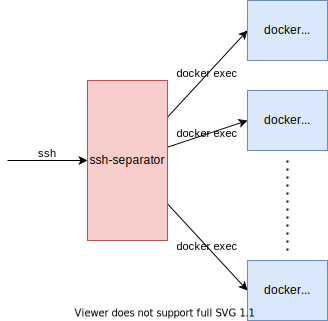

# ssh-separator
[](https://mazrean.github.io/ssh-separator/openapi/)
[](https://codecov.io/gh/mazrean/ssh-separator)
[](https://github.com/mazrean/ssh-separator/actions)
[](https://github.com/mazrean/ssh-separator/actions)
[](https://goreportcard.com/report/mazrean/ssh-separator)

Tool to distribute ssh connections to docker containers for each user


## Requirement
* docker

## Usage
### Launch
It can be started using docker.
For more information about environment variables, please see [Environment Variables](./#Environment Variables).

example
```
$ wget https://github.com/mazrean/ssh-separator/raw/main/docker-compose.yaml
$ docker compose up
```

## REST API
You can add users and reset the container for users via REST API.
See [OpenAPI](https://mazrean.github.io/ssh-separator/openapi/) for details.

## Environment Variables
|variable|description|example value|
|-|-|-|
|WELCOME|The string displayed upon successful login.|Login succeeded!|
|API_KEY|API key for REST API.|aeneexiene7uu3fie4pa|
|API_PORT|Port for REST API|3000|
|SSH_PORT|Port for ssh|2222|
|IMAGE_NAME|Docker image for user container|mazrean/cpctf-ubuntu:latest|
|IMAGE_USER|Username in user containers.|ubuntu|
|IMAGE_CMD|Shell in user containers.|/bin/bash|
|CPU_LIMIT|The number of CPUs to allocate to user containers.|0.5|
|MEMORY_LIMIT|Memory limits for user containers.|1024|
|BADGER_DIR|Directory where user data is stored.|/var/lib/ssh-separator|
|PROMETHEUS|If true, provide metrics for prometheus.|true|

## Author
Shunsuke Wakamatsu (a.k.a mazrean)

## Licence
MIT
